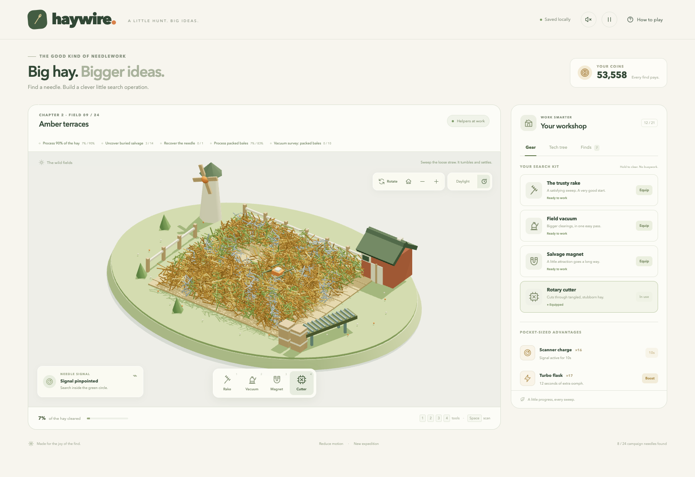
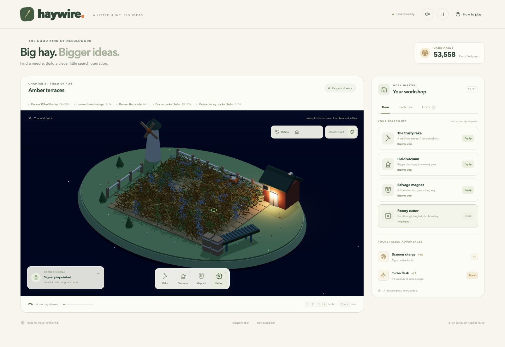

# Haywire

A cozy browser game about finding a very small thing with increasingly big ideas.

**Play:** run `npm start` in this folder, then open http://127.0.0.1:4173. Node.js 18 or newer is required. There is no install or build step. On macOS, you can also double-click `Play Haywire.command`.

## The hunt

Hold and drag across the hay to sweep. Fast, diagonal, and curved strokes are traced continuously; moving the brush adds clearing work bounded by real elapsed time and immediately stirs loose hay. Valuables pay automatically, and buried supplies go straight into your kit. Use the coins in the workshop to research three branches: better tools, sharper signals, and helpful machinery. Sweep over the glowing needle once exposed. Complete each field's processing and salvage goals, then take your equipment to the next field. Finding an early needle counts toward the goals while the hunt continues.

Later contracts add specialist surveys and directional zones. A survey needs distinct patches of the named material, swept with the named tool. Already cleared patches still count. Scanner clues help locate any remaining survey patches after recovering the needle.

- Twenty-four contracts across three chapters, with material, zone, and specialist objectives. Repeatable seeded remix contracts continue after the campaign while preserving your kit.
- Loose, packed, tangled, and static straw have different tool efficiencies.
- Real loose-hay rigid bodies tumble, collide with the piles and farm, slide, and settle. Repeated sweeps stir fallen straw; each tool applies different impulses.
- Rake, field vacuum, salvage magnet, and rotary cutter with different reach and behavior.
- Twenty-one permanent research nodes unlock over the chapters, including passive clearing drones and an automated sorting belt. Previously purchased upgrades stay owned.
- Scanner charges and twelve-second turbo boosts, with duplicate-use protection.
- Seven collectible relics, automatic selling, and guaranteed buried discoveries.
- Visit the barn for scanner deliveries, the windmill for turbo flasks, and the crates for coin pouches. Researched machinery can deliver extra supplies and sorting payments. Each reward can be collected once per field.
- Rotate the farm through a full circle, change your viewing angle, and zoom in on discoveries.
- A continuous four-minute day with warm sunrise, sunset, blue moonlight, stars, and porch lighting. The time button blends into the next lighting phase. Shadows fade out before changing direction, then return gently.
- Clues appear halfway through a hunt. Survey research makes them earlier and more precise.
- Locally saved progress with recovery from malformed data. Pause, sound, reduced motion, touch, and keyboard controls.

**Keyboard:** focus the field, use arrows to move your cursor, and hold Enter to sweep. 1, 2, 3, 4 switch tools. Space uses a scanner charge. P pauses. Escape dismisses dialogs.

**Camera:** right-drag, middle-drag, or Alt-drag to orbit. Scroll over the field to zoom, or use the + and − buttons. On a touchscreen, turn on **Rotate**, then drag. Turn it off to sweep again. The house button restores the original view. Click the farm buildings and equipment to visit them.

Sound starts muted. Pause, open dialogs, and hidden pages stop the simulation and daylight clock. Reduced motion also freezes loose-hay animation and the automatic day cycle; the time button still changes the lighting explicitly. No account, network service, or external asset CDN is needed. Progress is stored in this browser at this local address. Keep the port the same to keep the same browser save.

## Implementation

The interface uses native browser modules. Three.js 0.186.1 and Cannon-es 0.20.0 are bundled locally with their MIT licenses in `vendor/`. The farm is original procedural geometry, including instanced hay, animated equipment, projected pointer picking, lighting, and shadows. A simplified Canvas 2D fallback is included for browsers that cannot initialize WebGL. No downloaded game assets are used.

`engine.js` is a deterministic simulation separated from the renderer and interface. Prices, upgrade effects, payouts, and tool locks are defined centrally. Actual tile depth, materials, objectives, needle position, loot, and claimed farm deliveries are preserved across saves. Old six-field and twelve-field saves carry forward into the new sites. Loose-body transforms are transient visual simulation and reset on reload. Automation exposes the needle and leaves the final collection to the player.

Run `npm test` for simulation tests. Browser validation checks actual pointer and touch input, spending, item use, pause, save reload/recovery, mobile overflow, and the complete expedition. See `VALIDATION.md` for the tested scope and results.

## Inspiration and scope

This is an original single-player redesign based on the documented search, valuables, and upgrade loop in Studio Bitdot's [Needle In A Haystack Simulator](https://store.steampowered.com/app/5159870/Needle_In_A_Haystack_Simulator/). The reference store page was inspected on September 29, 2026. Its executable and private source were not accessed. Haywire uses a different visual identity, original code and art, finite hunts with material-specific tools and salvage goals, new tools and research balance, and no multiplayer. It is not an official version of the reference game.

## License

Original game code and procedural art are available under the [MIT license](LICENSE). Bundled libraries retain their own MIT notices in `vendor/` and are listed in [THIRD-PARTY-NOTICES.md](THIRD-PARTY-NOTICES.md).
